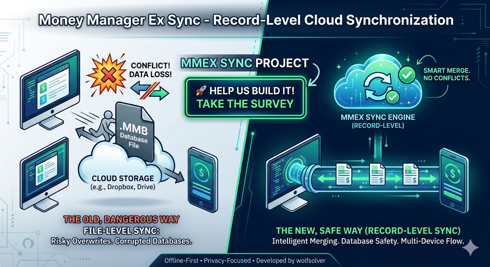

# MMEX Sync Engine POC (Sidecar Architecture)

> [!WARNING]
> This is a POC, not production-ready code.
> still not work perfectly



## Overview
This Proof of Concept (POC) demonstrates a non-intrusive, "Offline-First" synchronization system for Money Manager Ex (MMEX). The goal is to enable seamless multi-device sync (Windows <-> Cloud <-> Android) without requiring any changes to the existing MMEX C++ desktop codebase.

## Video
**Demo Video between Windows & Android**
[Demo Video between Windows & Android🤩](https://drive.google.com/file/d/1pKFcdcNuf47BQDFQAtPBOCC_B_BfgwxF/view)


**Demo Video between two Windows**
[Demo Video between two Windows🤩](https://1drv.ms/v/c/6958bccc4c47c1d3/IQAfDCUauF7dQo2GL1r47SziAfLlgfXdpo8-8-ustZM9CMA?e=5mPJBo)


### ⚠️ IMPORTANT: DISCLAIMER & WARNING

**This is a Proof of Concept (POC).** This software is provided for **educational and testing purposes only**. It is **NOT** intended for use with real, production, or important financial databases.

* **No Warranty:** This code is provided "as is" without any warranty of any kind. 
* **Liability:** The author(s) decline any responsibility for data loss, database corruption, or financial discrepancies resulting from the use of this software.
* **Safety First:** Always use a **copy** of your database (e.g., `sample_db.mmb`) for testing.

> **Funny Warning:**
> Using this script on your primary financial database is a great way to discover your inner "minimalist" by accidentally deleting your entire net worth. If your bank account suddenly looks as empty as a fridge on a Monday morning, don't say we didn't warn you! 💸🔥

### Additional info file
- [README_POCKETBASE.md](README_POCKETBASE.md): Pocketbase setup 


## Key Concepts

### 1. The "Sidecar" Approach
The Sync Engine runs as an optional, external process (Sidecar). It observes the MMEX database and handles communication with a PocketBase backend. If the Sync Engine is not running, MMEX continues to operate as a standard local application.

### 2. Zero-Impact Integration (SQLite Triggers)
To track changes without modifying the MMEX source code, this POC utilizes **SQLite Triggers**. These triggers automatically flag records for synchronization (`pb_is_dirty` flag or filling `pb_DELETED_RECORDS_LOG` table) when a user performs an Insert, Update or Delete within the desktop app. All the operations are managed in a transparent way for application.

### 3. Loop Protection (3-State Protocol)
To prevent infinite synchronization loops (where the Sync Engine's own updates trigger a new sync request), we implement a three-state logic:
- **`0` (Synced):** Data is up-to-date with the cloud.
- **`1` (Local Change):** User modified data; needs to be pushed to the cloud.
- **`2` (Cloud Ingress):** Sync Engine is writing data from the cloud; **Triggers ignore these operations.**

## Database Schema Extensions
The POC adds technical columns to the all tables:
- `pb_id`: Unique PocketBase identifier.
- `pb_updated_at`: ISO8601 timestamp from the server.
- `pb_is_dirty`: State flag (0, 1, or 2).
A table is also added to track deletion of records: `pb_DELETED_RECORDS_LOG` via trigger.

## 🛠️ Installation & Setup

1. **Clone the repository**:
   ```bash
   git clone https://github.com/wolfsolver/money_manager_ex_sync_poc.git
   cd money_manager_ex_sync_poc
   ```

2. **Install dependencies**:
   This project uses `better-sqlite3` for database interaction and the official `pocketbase` SDK.
   ```bash
   npm install
   ```

## 🚀 Usage

You can run the sync engine by providing configuration via command-line arguments or environment variables.

### Command Line Parameters
```bash
===========================================================
🚀 MMEX-PocketBase Sync Tool | Manuale Utente
===========================================================

Utilizzo: mmex-sync [PARAMETRI] [MODALITÀ]

-----------------------------------------------------------
📂 GESTIONE PROFILI E CONFIGURAZIONE
-----------------------------------------------------------
  --profile=nome      Sceglie il profilo (es. 'casa', 'lavoro'). 
                      Default: 'default'
  --ignoreProfile     Ignore profile configuration and use default values
  --listProfile       Mostra l'elenco dei profili disponibili
  --db=percorso       Percorso del file .mmb di MoneyManagerEx
  --url=indirizzo     URL dell'istanza PocketBase
  --user=email        Email di login PocketBase
  --pass=password     Password (non viene salvata, genera un token)
  --setDefaultMode=X  Imposta la modalità di default per il profilo
                      Valori: sync (default), run, watch
  --exe=percorso      Percorso dell'eseguibile MMEX.exe
                      Default: C:\\Program Files\\MoneyManagerEx\\bin\\mmex.exe					  
  --create            Delete and Recreates a new empty database
  --verbose           Mostra log dettagliati di ogni operazione.

-----------------------------------------------------------
🕹️ MODALITÀ DI SINCRONIZZAZIONE
-----------------------------------------------------------
  --sync              Esegue il ciclo completo (Init + Push + Pull).
  --sync=op1,op2      Esegue solo le operazioni specificate.
                      Operazioni disponibili: init, push, pull
  --force             Ignore flag and timestamp and process all records

  Esempi:
    node index.js --sync=pull           (Scarica solo i dati remoti)
    node index.js --sync=init           (Inizializza senza trasmettere nulla)
    node index.js --sync --force        (Ciclo completo con invio e scarico totale)

-----------------------------------------------------------
🕹️ MODALITÀ OPERATIVE
-----------------------------------------------------------
  --run               1. Sync iniziale 
                      2. Apre MMEX e attende la chiusura
                      3. Sync finale
  --watch             1. Sync iniziale
                      2. Apre MMEX (detached)
                      3. Monitora cambiamenti locali/remoti in tempo reale

-----------------------------------------------------------
⚡ COMANDI DI FORZATURA E MANUTENZIONE
-----------------------------------------------------------

-----------------------------------------------------------
🧹 PULIZIA (Attenzione!)
   Questi comandi vengono eseguiti da soli. 
   Altri parametri vengono ignorati.
-----------------------------------------------------------
  --clearDb           Rimuove colonne tecniche e trigger dal DB locale.
  --clearServer       Rimuove tutti i dati dalle collezioni sul server.

Esempio:
  node index.js --profile=casa --watch --verbose
=========================================================== 
```

### Using Command Line Arguments (Recommended)
```bash
node ./src/index.js --db="./my_database.mmb" --user="admin@example.com" --pass="YourPassword" --url="http://127.0.0.1:8090"
```

### Synchronization Flow
1. **Initialization:** On the first run, the script automatically adds the necessary columns and installs the SQLite triggers.
2. **Push Phase:** Local changes (flagged with `pb_is_dirty = 1`) are sent to PocketBase.
3. **Pull Phase:** The script fetches records updated since the last local sync and merges them into SQLite.


## 🧪 Quick Start: Testing the Sync (Step-by-Step)

### First run
You can simply run `mmex-sync` command, the default profile. On first start program ask for all relevent parameter and store in default profile.


### 4. Play with MMEX
For example you can run the script in run mode:
```bash
mmex-sync --run
```

or watch mode:
```bash
mmex-sync --watch
```


## Conclusion
This architecture proves that MMEX can be modernized with cloud capabilities while remaining a stable, offline-first desktop software. It respects the existing codebase and provides a modular path forward for the community.


