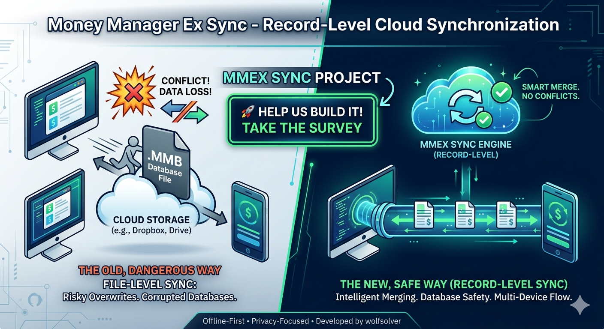

# MMEX Sync Engine POC (Sidecar Architecture)

> [!WARNING]
> This is a **Proof of Concept (POC)**, not production-ready software. It is still under active development and may not work perfectly in all edge cases.

[](https://github.com/moneymanagerex/mmex-sync/actions/workflows/pages/pages-build-deployment)
[](https://github.com/moneymanagerex/mmex-sync/actions/workflows/tests.yml)
[](https://github.com/moneymanagerex/mmex-sync/actions/workflows/release.yml)


[](https://github.com/moneymanagerex/mmex-sync/releases/latest)




## References
- [how to contribute](CONTRIB.md)
- [Setup pocketbase server](README_POCKETBASE.md)
- [Disclaimer](DISCLAIMER.md)
- [First Run](docs/startup.md)

## 🎯 Overview

This project demonstrates a non-intrusive, **"Offline-First"** synchronization system for Money Manager Ex (MMEX). It enables seamless multi-device sync (Windows ↔ Cloud ↔ Android) without requiring any modifications to the core MMEX desktop source code.

### The "Sidecar" Philosophy

The Sync Engine operates as an external "Sidecar" process. It watches your SQLite database and communicates with a **PocketBase** backend. If the engine is off, MMEX remains a standard local app; if it's on, your data goes global.

### Video
**Demo Video between Windows & Android**
[Demo Video between Windows & Android🤩](https://drive.google.com/file/d/1pKFcdcNuf47BQDFQAtPBOCC_B_BfgwxF/view)


**Demo Video between two Windows**
[Demo Video between two Windows🤩](https://1drv.ms/v/c/6958bccc4c47c1d3/IQAfDCUauF7dQo2GL1r47SziAfLlgfXdpo8-8-ustZM9CMA?e=5mPJBo)

### 📱 Android Sync App

For Android synchronization, you **must use** the specific sync-enabled version of the application:
* **File to use:** `ammx-X.Y.Z-sync-release.apk` (where `X.Y.Z` represents the version).
* **Download:** Available on the official GitHub repository releases: 👉 **[Latest Releases](https://github.com/moneymanagerex/android-money-manager-ex/releases/latest)**.

For detailed configuration instructions, refer to the [Sync Setup Guide (First Run)](docs/startup.md).

---

## ⚠️ IMPORTANT: DISCLAIMER & WARNING
**This is a Proof of Concept (POC).** This software is provided for **testing purposes only**. It is **NOT** intended for use with real, production, or important financial databases.

* **No Warranty:** This code is provided "as is" without any warranty of any kind. 
* **Liability:** The author(s) decline any responsibility for data loss, database corruption, or financial discrepancies resulting from the use of this software.
* **Safety First:** Always use a **copy** of your database (e.g., `sample_db.mmb`) for testing.

> [!WARNING]
> Using this script on your primary financial database is a great way to discover your inner "minimalist" by accidentally deleting your entire net worth. If your bank account suddenly looks as empty as a fridge on a Monday morning, don't say we didn't warn you! 💸🔥

---
## 🌐 Server Hosting Options

The Sync Engine requires a PocketBase backend to coordinate data across devices. You have two main options for setting up the server:

### 1. Community Shared Server (Easiest)
If you don't want to manage your own infrastructure, you can request access to the unofficial test shared instance hosted at:
👉 **[mmex-sync.prudenzano.org](https://mmex-sync.prudenzano.org)**

* **Self-Service Control Panel:** A portal is available at [mmex-sync.prudenzano.org/selfservice/](https://mmex-sync.prudenzano.org/selfservice/) where you can manage your sync data (export data, clear sync data, or completely delete your account).

> [!NOTE]
> Access to the shared server may require registration or approval. Please check the website for instructions on how to request your credentials.

### 2. Self-Hosted Server (Private & Control)
For maximum privacy and control over your financial data, you can easily deploy your own PocketBase instance on any cloud provider, VPS, or home server (e.g., Raspberry Pi, Docker, etc.).
* Download PocketBase from the official website.
* Deploy the required collections schema (see the `pb_schema_selfhost.json` file).
* Use your custom URL during the first setup (e.g., `http://your-vps-ip:8090`).


--- 

## 🕹️ How to Use

The engine can be launched in different modes depending on your workflow.

### 0. First Setup (Web Wizard)

When you launch `mmex-sync` for the first time (or whenever no profiles are configured), the program automatically launches a local web server and opens the **First-Run Configuration Wizard** in your default web browser:

```bash
C:\> mmex-sync
👋 No profiles found. Launching Web Setup Wizard...
🌐 Web UI Server running at http://127.0.0.1:4567
```

The Web Wizard guides you step-by-step through setting up your initial profile. Once filled, you can choose between two actions:
* **Save & Run:** Saves the profile configuration, closes the Web UI server, and immediately starts the synchronization / MMEX workflow in your terminal.
* **Save & Exit:** Saves the profile configuration and exits cleanly back to the command prompt.

> [!TIP]
> You can open the Web Management Dashboard at any time to create, edit, rename, or delete profiles by running:
> ```bash
> mmex-sync --gui
> ```

---

#### 🔍 Profile Configuration Parameters in Detail

The table below explains every single parameter configurable in a profile (accessible via the First-Run Wizard and the Profile Manager modal in the Web UI):

| Parameter | Field in Web UI | Required | Description |
| :--- | :--- | :---: | :--- |
| **Profile Name** | `Profile Name` | Yes | Unique name / identifier for the profile (e.g., `default`, `personal`, `work`). On first-run setup, it defaults to `default` and is automatically set as the active default profile. |
| **Database Path** | `Database Path (.mmb / .emb)` | Yes | Absolute or relative path to your local Money Manager Ex database (`.mmb` standard SQLite file or `.emb` encrypted database). Supports `~` home directory expansion. You can click the **Browse** button to select the file using the native OS file picker. |
| **Database Password** | `Database File Password (.emb)` | Conditional | Visible only when a `.emb` (encrypted) database file is selected. Used to decrypt/encrypt the database on the fly during synchronization. |
| **Save DB Password** | `Save database password securely in profile` | Optional | Checkbox for `.emb` files. When checked, securely stores the password in the local profile configuration so you are not prompted on each run. |
| **PocketBase URL** | `PocketBase Server URL` | Yes | The HTTP/HTTPS endpoint of your PocketBase instance (e.g., `https://mmex-sync.prudenzano.org` for the community server, or `http://127.0.0.1:8090` / `http://your-server-ip:8090` for self-hosted servers). |
| **PocketBase User** | `PocketBase User / Email` | Yes | The user email address or username registered on your PocketBase instance used to authenticate sync sessions. |
| **PocketBase Password** | `PocketBase Password` | Setup / Edit | Your PocketBase account password. It is transmitted once to the server to obtain a secure JWT session token (`pbToken`). Plaintext passwords are never saved in the configuration file. |
| **Default Sync Mode** | `Default Sync Mode` | Yes | The default execution mode when running `mmex-sync` with this profile:<ul><li>**Run** (`run`, Default): Initial sync → Launches MMEX desktop → Final sync upon closing MMEX.</li><li>**Watch** (`watch`): Initial sync → Launches MMEX → Real-time continuous background monitoring of local and remote changes.</li><li>**Sync** (`sync`): Immediate full sync cycle (Pull + Push) and exit without opening the MMEX desktop interface.</li></ul> |
| **MMEX Executable Path** | `MMEX Executable Path (Support File)` | Required for `run`/`watch` | The path to your local Money Manager Ex application executable (`mmex.exe` on Windows, or `mmex` on Linux/macOS). Includes two helper buttons:<ul><li>**Auto-Detect:** Automatically searches standard OS installation directories for MMEX.</li><li>**Browse:** Opens native OS file picker dialog to locate the binary manually.</li></ul> |
| **Active Default Profile** | `Set as active default profile` | Optional | (In Profile Modal) Sets this profile as the global `defaultProfile` in `mmex-sync.config.json`. When running `mmex-sync` without explicit `--profile=name`, this profile is executed. |

---

### 1. Normal run (Default Mode)
After first launch, you can run the program with:
```bash
C:\> mmex-sync 
```
which executes the default mode (`--run`): initial sync → launch MMEX → final sync.

### 2. Daily Workflow Modes

These modes manage the lifecycle of the MMEX application for you:

#### **`--run` (The "Sandwich" Sync):**
1. Performs an initial Sync (Pull/Push).
2. Launches MMEX and waits for you to finish.
3. Performs a final Sync after you close MMEX to save changes to the cloud.


```bash
mmex-sync --run
```


#### **`--watch` (Real-Time Sync):**
1. Performs an initial Sync.
2. Launches MMEX in the background.
3. Continuously monitors for local or remote changes and syncs them instantly.


```bash
mmex-sync --watch
```

#### Set your default mode
You can set the default mode by running:

```bash
mmex-sync --setDefaultMode=run
```
or
```bash
mmex-sync --setDefaultMode=watch
```
after this you can run without arguments
```bash
mmex-sync
```

### 3. Manual Synchronization

Use these if you want to sync data without opening the MMEX interface:

* **Full Cycle:** `mmex-sync --sync` (Init + Push + Pull).
* **Pull Only:** `mmex-sync --sync=pull` (Download remote data).
* **Push Only:** `mmex-sync --sync=push` (Upload local changes).
* **Force Sync:** `mmex-sync --sync --force` (Processes all records regardless of timestamps).

### 4. Profile Management

You can manage different databases (e.g., "Home" vs "Work") using profiles:

* **Select Profile:** `mmex-sync --profile=work`.
* **Set Default Profile:** `mmex-sync --setDefaultProfile=work` (sets `work` as the default profile in `mmex-sync.config.json` so running `mmex-sync` without `--profile` uses `work`).
* **Rename Profile:** `mmex-sync --renameProfileTo=newname` (renames current profile to `newname` and updates default profile reference if needed).
* **List Profiles:** `mmex-sync --listProfile` (shows available profiles and marks the default profile with `(default)`).
* **Show Profile Info:** `mmex-sync --showProfile[=name]` (shows configuration details for a profile).
* **Delete Profile:** `mmex-sync --deleteProfile[=name]` (deletes the current default profile or a specific profile).
* **Web UI Dashboard:** `mmex-sync --gui` (launches local browser-based management dashboard).

---

## ⚙️ Configuration & Setup

### First Run & Web UI

* **First Run:** When no profiles exist, running `mmex-sync` automatically starts the local web server and opens your browser to the **First-Run Configuration Wizard**, guiding you through creating and configuring your initial default profile.
* **Headless Execution:** When one or more profiles are already configured, running `mmex-sync` executes in headless mode using the active default profile without starting the web interface.
* **Direct Web UI Launch:** Run `mmex-sync --gui` at any time to open the management dashboard immediately.
* **Native File Picker (Browse Button):** The Web UI allows browsing local file paths directly via native OS dialogs. On **Linux**, this feature requires either **`zenity`** or **`kdialog`** installed on your system (e.g., `sudo apt install zenity` or `sudo dnf install zenity`).

### Command Line Arguments

> [!NOTE]
> **Case-insensitivity:** All parameters are case-insensitive (e.g., `--CHECKFORUPDATE`, `--DB`, `--verbose`, `--GUI` work interchangeably with their lowercase or camelCase equivalents). Values for parameters (such as passwords, profile names, or file paths) remain case-sensitive.

```bash
===========================================================
🚀 MMEX-PocketBase Sync Tool | User Manual
===========================================================

Usage: mmex-sync [PARAMETERS] [MODE]

-----------------------------------------------------------
📂 PROFILE AND CONFIGURATION MANAGEMENT
-----------------------------------------------------------
  --profile=name      Selects the profile (e.g., 'home', 'work'). 
                      Default: 'default'
  --ignoreProfile     Ignore profile configuration and use default values
  --listProfile       Shows the list of available profiles
  --showProfile[=name] Shows profile information (content of profile)
  --deleteProfile[=name] Deletes default profile or specified profile
  --gui               Starts the local Web UI dashboard directly
  --db=path           Path to the MoneyManagerEx .mmb file
  --url=address       URL of the PocketBase instance
  --user=email        PocketBase login email
  --pass=password     Password (not saved, generates a token)
  --setDefaultProfile=X Sets default profile name in mmex-sync.config.json
  --renameProfileTo=X  Renames current profile to new name
  --setDefaultMode=X  Sets the default mode for the profile
                      Values: sync (default), run, watch
  --exe=path          Path to the MMEX.exe executable
                      Default: C:\Program Files\MoneyManagerEx\bin\mmex.exe
  --serverType=name   Remote server type to use. Default: pocketbase
  --create            Delete and Recreates a new empty database
  --verbose           Shows detailed logs of each operation.

-----------------------------------------------------------
🕹️ SYNCHRONIZATION MODES
-----------------------------------------------------------
  --sync              Executes the complete cycle (Init + Push + Pull).
  --sync=op1,op2      Executes only specified operations.
                      Available operations: init, push, pull
  --force             Ignore flag and timestamp and process all records

  Examples:
    mmex-sync --sync=pull           (Download remote data only)
    mmex-sync --sync=init           (Initialize without transmitting anything)
    mmex-sync --sync --force        (Full cycle with total send and receive)

-----------------------------------------------------------
🕹️ OPERATING MODES
-----------------------------------------------------------
  --run               1. Initial Sync 
                      2. Opens MMEX and waits for closure
                      3. Final Sync
  --watch             1. Initial Sync
                      2. Opens MMEX (detached)
                      3. Monitors local/remote changes in real-time

-----------------------------------------------------------
⚡ FORCING AND MAINTENANCE COMMANDS
-----------------------------------------------------------

-----------------------------------------------------------
🆙 AUTO-UPDATE COMMANDS
-----------------------------------------------------------
  --checkForUpdate       Checks for newer versions on GitHub and suggests download.
  --autoDownloadUpdate   Downloads and installs the latest compatible version.

-----------------------------------------------------------
🧹 CLEANUP (Warning!)
   These commands are executed alone. 
   Other parameters are ignored.
-----------------------------------------------------------
  --clearDb           Removes technical columns and triggers from the local DB.
  --clearServer       Removes all data from the collections on the server.

Example:
  mmex-sync --profile=casa --watch --verbose
===========================================================
```

---

## 🛠️ Technical Concepts

* **Zero-Impact Integration:** Uses **SQLite Triggers** to track changes (`pb_is_dirty` flags) without touching the C++ code.
* **Loop Protection:** Implements a **3-State Protocol** (Synced, Local Change, Cloud Ingress) to prevent infinite sync loops.
* **Maintenance:**
* `--clearDb`: Removes all technical columns and triggers from your local DB and restore it to a normal Money Manager Ex DB
* `--clearServer`: Wipes all data from the PocketBase collections (without removing your user & password)

## Conclusion
This architecture proves that MMEX can be modernized with cloud capabilities while remaining a stable, offline-first desktop software. It respects the existing codebase and provides a modular path forward for the community.

